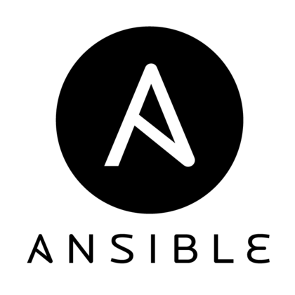

# 👋 Hi everyone !
- 👀 I am interested in sports (badminton, e-sport, gym), music, space and a lot of other things!
- 🌱 Currently, I am in my third year of studying at Epitech Strasbourg.
- 🔒 My passion lies in cybersecurity, cloud computing, and DevOps.
- 🌍 My plan for next year is to spend a year abroad in Edimbourg and obtain a double degree in Network Security from Heriot-Watt University.

## Contact-me ! 📝

 
 

## Programming Languages 🖥️

<!---->

 

## Stats 📊
<!--
 -->

 

<!-- username=Remi-Mergen -->
